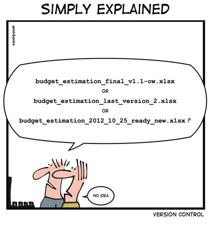
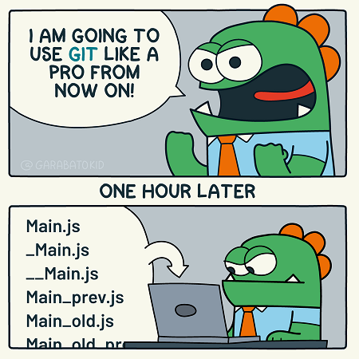

```{r setup, include=FALSE}
knitr::opts_chunk$set(echo = FALSE, fig.align='center')
```


# The Problem

.center[]

---
# Homemade Code Archive

### Working Folder  

read_data.R  
explore_data.R  
fit_glms.R


### Archive  

read_data_2023_01_20.R  
explore_data_2023_01_20.R  
explore_data_2023_01_24.R  
fit_glms_2023_01_24.R  
fit_glms_2023_01_26.R  
fit_glms_2023_01_27.R  

---
# Pros and Cons of a Homemade Archive

### Benefits

- One active copy of each file (no confusion over which to run)   
- Dated (able to reproduce/approximate earlier analyses)  
- Perhaps, it fulfils 80% of your needs

### Limitations

- Restoring to an earlier date has to be done manually and is not exact   
- Not clear what changed between versions or why they were archived    
- Difficult to work on two developments at the same time
- Not designed for sharing/collaboration  
  - who made what changes  
  - who has overall control  
  - possible conflicts if two people modify the same current script  
- This archiving system is not widely used    
- This archiving system is not integrated into RStudio or VSCode  
---
# Professional Archiving of Code

<br>

- **Git** and **subversion (SVN)** are both free and create similar, but not compatible, code archives

- **Git** is the most widely used  

- **Git** was written by software developers for software developers  

- the terminology of **Git** can be off-putting for data scientists  

- **Git** is designed for version control of code. It is not suitable for archiving data  

- you make a separate **Git** archive for each project  

- **Git** can create local archives (on your computer) or remote archive (on a shared drive or in the cloud)  

---
# Git Terminology  

<br>

Git term   |   meaning  
------------------|--------------------------------  
**repository**   (repo) | an archive  
**local**             | on your computer  
**remote**            | not on your computer e.g. in the cloud  
**to stage**          | to mark a file for inclusion in the next commit    
**to commit**         | to save/update the files in an archive  
**.gitignore**         | text file listing file types that Git will ignore when committing  

<br>
<br>

A local Git repo is just a (hidden) folder called **.git** within your project folder. **Do not play with the contents!!**  

---
# Main Branch

Soon you will have a chain of commits called the main (master) branch

```{r echo = FALSE, fig.align='center'}
library(DiagrammeR)

grViz("
digraph dot {

graph [layout = dot,
       rankdir = LR]

node [shape = square,
      style = filled,
      color = cyan,
      label = 'Commit 1']
a

node [shape = square,
      style = filled,
      color = cyan,
      label = 'Commit 2']
b

node [shape = square,
      style = filled,
      color = cyan,
      label = 'Commit 3']
c


edge [color = black]
a -> {b}
b -> {c}
}")
```


---
# Extra Branches

Most local repos only have one branch  

You could go back to commit 2 and work on an alternative version of the code. This would create a second branch.  

Separate branches are most useful when two people collaborate  

```{r echo = FALSE}
library(DiagrammeR)

grViz("
digraph dot {

graph [layout = dot,
       rankdir = LR]

node [shape = square,
      style = filled,
      color = cyan,
      label = 'Commit 1']
a

node [shape = square,
      style = filled,
      color = cyan,
      label = 'Commit 2']
b

node [shape = square,
      style = filled,
      color = cyan,
      label = 'Commit 3']
c

node [shape = square,
      style = filled,
      color = cyan,
      label = 'Commit 4']
d

node [shape = square,
      style = filled,
      color = cyan,
      label = 'Commit 5']
e

node [shape = square,
      style = filled,
      color = cyan,
      label = 'Merge']
f

edge [color = black]
a -> {b}
b -> {c d}
d -> {e}
c -> {f}
e -> {f}
}", height=200)
```

---
# More Git Terminology

<br>

Git term   |   meaning  
------------------|--------------------------------
**branch**  | a chain of commits  
**main branch**             | the original chain       
**merge**   | combine two branches  
**HEAD**            | the commit that you are currently working on  
**diff**     | the code changes between two commits  

---

# Git Interfaces

* Via a **terminal** using linux style commands  
  - `git commit -m "Newcastle presentation"`  
  - does everything but not easy to learn   
<br>
* Via a Git **client**  
  - graphical interface .. click and drag  
  - https://Git-scm.com/download/gui/windows   
  - many are free   
<br>
* Via **RStudio**  
  - Git tab - very basic Git client  
  - terminal tab - for more advanced tasks  

---
# Web-based Archives

<br>

- **GitHub**, **bitbucket**, **GitLab**, **sourceforge** and others, offer cloud-based hosting of **Git** archives  

- **GitHub** is the most widely used  

- **GitHub** is often used to mirror a local **Git** archive  

- **GitHub** is ideal for collaboration and dissemination  

- **GitHub** encourages openness in data analysis    

- archives copied to **GitHub** can be private, but there is a strong case for making research archives public whenever possible  

---
# GitHub Terminology


GitHub term   |   meaning   
------------------|--------------------------------  
**push**  | sync by copying from your local repo to your GitHub repo  
**pull**  | sync by copying from your GitHub repo to your local repo   

<br>

```{r echo = FALSE}
library(DiagrammeR)

grViz("
digraph dot {

graph [layout = dot,
       rankdir = TB]

node [shape = rectangle,
      style = filled,
      fillcolor = beige,
      color = black,
      height = 0.3,
      width = 1,
      label = 'Your\nGitHub Repo', fontsize=7]
a

node [shape = rectangle,
      style = filled,
      fillcolor = azure,
      color = black,
      height = 0.3,
      width = 1,
      label = 'Your\nLocal Git repo', fontsize=7]
b


edge [color = black]
a -> {b}[label = '  pull         ', fontsize=9]
b -> {a}[label = '   push  ', fontsize=9]
}", height = 350)
```


---
# More Github Terminology

GitHub term   |   meaning  
------------------|--------------------------------  
**clone** | make a local copy of a GitHub repo  
**fork**  | copy another user's GitHub repo to your own GitHub account     

```{r echo = FALSE}
library(DiagrammeR)

grViz("
digraph dot {

graph [layout = fdp,
       rankdir = TB]

node [shape = rectangle,
      style = filled,
      fillcolor = beige,
      color = black,
      label = 'Another\nGitHub Repo',
      fontsize = 8]
c

node [shape = rectangle,
      style = filled,
      fillcolor = beige,
      color = black,
      label = 'Your\nGitHub Account',
      fontsize = 8,
      size = 1]
a

node [shape = rectangle,
      style = filled,
      fillcolor = azure,
      color = black,
      label = 'Your\nLocal Computer',
      fontsize = 8]
b


edge [color = black]
c -> {a}[label = 'fork', fontsize = 8, arrowsize=0.5, color=blue, fontcolor=blue]
c -> {b}[label = ' clone ', fontsize = 8, arrowsize=0.5, color=blue, fontcolor=blue]
}", height=350)
```

---

# GitHub Services  

service  |   meaning  
------------------|--------------------------------  
**Issue** | message pointing out bugs or suggesting improvements      
**Pull request** | message to ask the owner to merge code that you have changed  
**Project**  | spreadsheet for organising issues and pull requests  
**Codespace**  | cloud computing provided by GitHub   
**Action** | task performed automatically by GitHub in response to some trigger    
**Pages** |  hosts for a website linked to a repository    
**LFS**  | Large File Storage for data (separate download https://git-lfs.com/)   

<br>

**All Free** but with limits. For example, a free account has 120 core hours per month of Codespace, Free LFS is limited to 1GB.  

GitHub file size limited to 50MB. Repository size limited to 1GB. An account can have any number of repos.  

---
# Git Requires Effort

.center[]