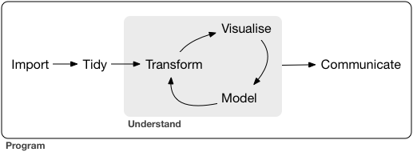

```{r setup, include=FALSE}
knitr::opts_chunk$set(echo = FALSE)
xaringanExtra::use_panelset()
```

# The tidyverse workflow

.center[]

<br>

-   tidyverse packages for each stage    
-   all data analysis projects have a similar structure  
-   adopt a best practice approach to all stages of the project  

---
# A More Realistic Data Analysis
```{r echo = FALSE, fig.align='center', fig.height=5, fig.width=7}
library(DiagrammeR)

grViz("
digraph G {
graph[   rankdir = LR]

subgraph cluster_1 {
   label = 'Raw Data'
   fontsize = 20;
   fontcolor = 'blue';
   node [shape = rectangle,
      style = filled,
      fillcolor = beige,
      color = black,
      height = 0.3,
      width = 0.8,
      fontsize=9]
   a1 [label = 'local']
   a2 [label = 'local']
   a3 [label = 'remote']

   edge[style=invis];
   a1 -> a2 -> a3;
   }

subgraph cluster_2 {
   label = 'R Format Copies'
   fontsize = 20;
   fontcolor = 'blue';
   node [shape = rectangle,
      style = filled,
      fillcolor = lightblue,
      color = black,
      height = 0.3,
      width = 0.8,
      fontsize=7,
      label = ' ']
   b1 b2 b3

   edge[style=invis];
   b1 -> b2 -> b3;
   }

subgraph cluster_3 {
   label = 'Clean Data'
   fontsize = 20;
   fontcolor = 'blue';
   node [shape = rectangle,
      style = filled,
      fillcolor = lightblue,
      color = black,
      height = 0.3,
      width = 0.8,
      fontsize=7,
      label = ' ']
   c1 c2 c3

   edge[style=invis];
   c1 -> c2 -> c3;
   }

subgraph cluster_4 {
   label = 'Preprocessed Data'
   fontsize = 20;
   fontcolor = 'blue';
   node [shape = rectangle,
      style = filled,
      fillcolor = lightblue,
      color = black,
      height = 0.3,
      width = 0.8,
      fontsize=7,
      label = ' ']
   d1 d2 d3 d4 d5 

   edge[style=invis];
   d1 -> d2 -> d3 -> d4 -> d5;
}
   
   subgraph cluster_5 {
   label = 'Analysis DataSets'
   fontsize = 20;
   fontcolor = 'blue';
   node [shape = rectangle,
      style = filled,
      fillcolor = lightblue,
      color = black,
      height = 0.3,
      width = 0.8,
      fontsize=7,
      label = ' ']
   e1 e2 

   edge[style=invis];
   e1 -> e2;
   }
   
  subgraph cluster_6 {
   label = 'Analysis One'
   fontsize = 20;
   fontcolor = 'blue';
   node [shape = rectangle,
      style = filled,
      fillcolor = pink,
      color = black,
      height = 0.3,
      width = 0.8,
      fontsize=7,
      label = ' ']
   f1 f2 f3 f4 

   edge[style=invis];
   f1 -> f2 -> f3 -> f4;
  }
   
     subgraph cluster_7 {
   label = 'Analysis Two'
   fontsize = 20;
   fontcolor = 'blue';
   node [shape = rectangle,
      style = filled,
      fillcolor = pink,
      color = black,
      height = 0.3,
      width = 0.8,
      fontsize=7,
      label = ' ']
   g1 g2 g3 

   edge[style=invis];
   g1 -> g2 -> g3;
     }
   
        subgraph cluster_8 {
   label = 'Analysis Three'
   fontsize = 20;
   fontcolor = 'blue';
   node [shape = rectangle,
      style = filled,
      fillcolor = pink,
      color = black,
      height = 0.3,
      width = 0.8,
      fontsize=7,
      label = ' ']
   h1 

   }
edge [color = black]
a1 -> b1 -> c1 -> d1 -> e1
c1 -> d2 -> e1
a2 -> b2 -> c2 -> d3 -> e1 -> g1
e1 -> g2 -> h1
e1 -> g3
c3 -> e1 -> f1 -> h1
e1 -> f2
c2 -> d4 -> e2 -> f3
a3 -> b3 -> c3 -> d5 -> e2 -> f4
}", height = 600, width = 800)
```
---
# Notes on the Realistic Project

<br>
- You do not have this diagram .. instead, you have a folder of data files and R scripts  
<br>
- You have many R scripts  
    - `read_local.R`, `read_remote.R` etc.  
<br>
- The scripts have been through many iterations  
    - `read_local.R`, `read_local2.R`, `read_local3.R`, `read_local3_update.R` etc.  
<br>
- You are not the only person working on these data  

---
# A Typical Scenario

- You prepare `Analysis One` and find an association of `1.37` between gene A and Disease X, which you present at a conference in Newcastle   
<br>
- A colleague prepares `Analysis Two` and presents their results in Paris  
<br>
- The professor decides to take the credit by writing an article about `Analysis Three` (combining One and Two)  
<br>
- The professor asks for your results and discovers that Analysis One is based on `n=4112` and Analysis Two is based on `n=4114`. They tell you both to sort it out  
<br>
- The problem lies in the exclusions, so you decide to include only patients accepted in both analyses, `n=4107`   
<br>
- You re-run Analysis One and get an updated association of `1.35`, which you email to the professor  
---
# Your Analysis Unravels

<br>
- In the middle of the night it dawns on you that you excluded the extra patients in `analysis_one_v8_for_prof.R`, but they were not excluded from the pre-processing  
<br>
- You remove the new exclusions to create `analysis_one_v8_for_prof2.R` and add them to `local_clean3.R` to create `local_clean3_strict.R`, which you run.  
<br>
- You now re-run the pre-possessing scripts `local_pca_v5.R` and `local_normalise_v3.R`, but you cannot recall whether you previously normalised before pca, or vice versa. You are not sure whether it matters, so you try both, the association is either `1.32` or `1.41`  
<br>
- You avoid the professor, while you try to sort it out.  
---
# Things Get Worse

<br>
- You get an email from Perth. Someone was at your Newcastle talk and based on the association of `1.37`, they are planning to do some experiments on mice. They want to know what happens to 1.37 when you adjust for sex. The are sure that the adjusted analysis will be quick to run and the result will inform their experimental design.  
<br>
- You try to reconstruct the analysis based on n=4112, but when you re-run it without sex adjustment, you now get `1.30`. You have no idea why. Sex adjustment of this new analysis changes the result to `1.16`, which looks as if it could be important. 
<br>
- You work for days trying to reconstruct the Newcastle analysis, but are unsuccessful. Perth email questioning the delay as they want to start their experiment. You are still avoiding the professor.    
<br>
- You would like to ask for help, but fear that if this became public, you would never get another job. You are sure that nobody else is this disorganised.   
 
---
# Reasons for adopting Best Practice

### Error avoidance

**Errors are inevitable. Adopt a practices that minimise them or make them easier to spot**

### Efficiency

**Data analysis is difficult and time consuming. Adopt practices that save time and effort**

### Clarity & Reproducibility

**Your methods must be clear. If you cannot reproduce a result exactly, how do you know if it is correct?**

### Communication

**Science is worthless unless it is shared. Cover-ups are unethical**

---
# Best Practice in Data Analysis

### Reasons

- Error Avoidance  
- Efficiency  
- Clarity & Reproducibility  
- Communication

### Ways to Achieve Good Practice

- Standardisation  
- Archiving  
- Documentation  
- Modularisation    
- Testing and checking  
- Openness  

---
# Methods

.panelset[
.panel[.panel-name[Standardise]
###Standardisation

- work in a consistent structured way
  - standard folder structure
  - standard file naming convention      
  - same archiving method  
- follow an R style guide   
- reuse the same skills (packages)  
]
.panel[.panel-name[Archive]
###Archive

- archive your code frequently  
- archive the data when it changes    
- archive results so that you do not re-run the same code  
- record the methods that you use
  - the order that scripts need to be run   
  - the versions numbers of any software or packages    
  - seeds used for simulations and Bayesian computations    
]
.panel[.panel-name[Document]
###Documentation  

- documentation is tiresome but essential 
- document as you go along. You will forget very quickly  
- make a README and keep it up to date    
- do NOT use undocumented short cuts
  - click-based software or manual data editing    
  - cut/paste into a report      
- place comments within your scripts  
- document the data as well as your code  
- write internal reports on all intermediate steps      
- keep an analysis diary      
]
.panel[.panel-name[Functions]
###Modularisation

- modularise your code   
- DRY => Don't Repeat Yourself  ... avoid repetitive code   
- write functions for common tasks  
- place your functions in a package  
- share your functions  
- use existing functions whenever you can  
- adopt the functional programming style  
]
.panel[.panel-name[Testing]
###Testing & Checking

- start simple .. test .. add to the complexity  
- prepare a dashboard for data exploration  
- print/plot/tabulate to inspect intermediate results  
- try to reproduce known findings  
- test each module/function before using it   
- check whether results change whenever you "improve" the code  
- use a smaller dataset when developing the analysis  
  - quicker and easier to check  
]
.panel[.panel-name[Openness]
###Openness

- openness encourages higher standards  
- collaborate, share the load     
- make your code public  
  - to help others  
  - someone might suggest an improvement    
- start a conversation with other researchers  
- write a blog  
- use social media to publicise your work  
]
]
---
# Useful Software

<br>
<br>

- **git**: professional archiving tool for code/scripts   
- **github**: a cloud based repository that uses git     
- **rmarkdown**: creates reproducible documentation; report, slides, blog, article, thesis  
- **quarto**: an extension to rmarkdown  
- **renv**: R package for recording/controlling package version numbers  
- **repo**: A package for archiving data and results  
- **makepipe**: A package for ordering R scripts  
- **targets**: R package for creating reproducible workflows and caching intermediate results (cf repo + makepipe)   

There are many more R workflow packages, see  https://github.com/jdblischak/r-project-workflows  

